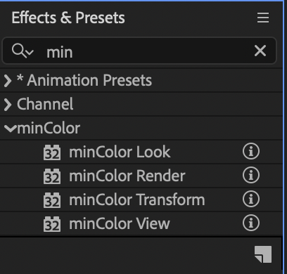
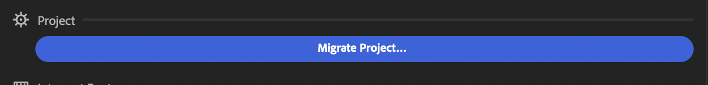
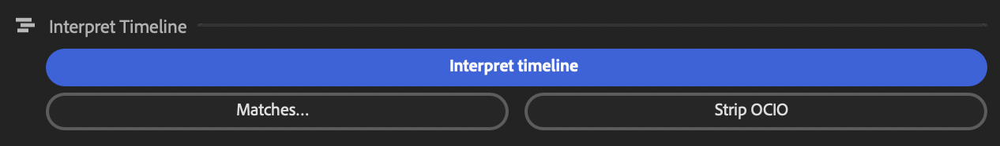
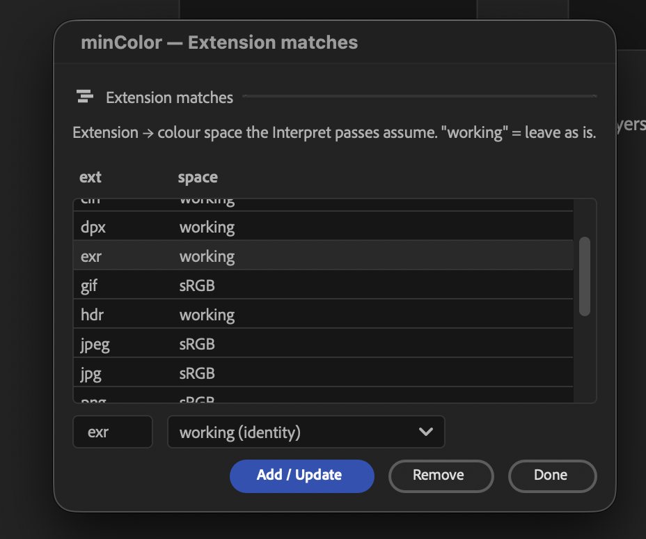
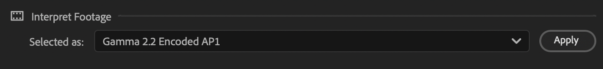
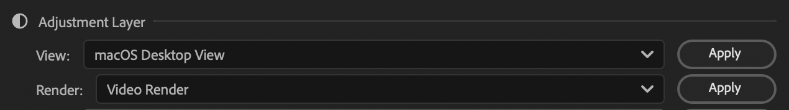

# minColor

**minColor** is an OCIO-based color setup and a workflow plugin for Adobe After Effects. It manages your media and timeline color spaces —  bypassing AE's "Interpret Media" workflow.

> minColor's approach is inspired by **Brendan Bolles' [fnordware OpenColorIO plug-in](https://www.fnord.com) for After Effects**. See [Credits & third-party notices](THIRD-PARTY-NOTICES.md).

**OCIO-based workflows:**
- Several **Linear** workflows with common `ACES` and `Blender` staples (ACEScg, ACES AP0, linear rec.709, linear rec.2020). These have familiar settings for anyone comfortable with `ACES` or `Blender` setups.
- An **SDR** workflow meant to supplement Adobe's legacy ICC/ICM workflow for daily SDR work. The SDR config is based on a `Rec. 709, Gamma 2.2` working space, with easy transforms to `sRGB` and `Rec. 1886` for viewing and output.
- All profiles use the working space and default media space as `scene_linear` so no more ACEScg vs ACES2065-1 dancing.

Windows- and macOS-flavored view transforms are provided to counteract differences in how After Effects handles color management in each OS. Use this workaround for proper viewport colors on macOS until Adobe fixes it.

---

## Install

### macOS

Download `minColor-<version>.pkg` from [Releases](https://github.com/cbkow/minColor/releases/latest), quit After Effects, and run it. Signed and notarized.

### Windows

Download `minColor-<version>.msi` from [Releases](https://github.com/cbkow/minColor/releases/latest), quit After Effects, and run it. The installer is unsigned, so Windows will ask for permission to run it.

---

## The Basics

minColor provides:

#### A scriptUI control panel for daily usage.

#### And OCIO effects

---

## Usage

The Effects layers work just like OCIO native plugins in AE but bypass AE’s color management. When you `migrate` a project, it loads a dummy OCIO profile that simply assigns a working and media default space to the same profile value. Meaning every item in an `ACEScg` project will, by default, be interpreted as `ACEScg` without additional transformations.

This is a hack to effectively tell AE to ***stop thinking about what you are doing!*** The real OCIO profiles are embedded in the plugins and are not dependent on file paths.

You can then use the minColor effects as a substitute for AE’s default OCIO effects, and mimic a similar OCIO workflow as the classic fnord plugin.

---

## Using the panel

#### **Migrate a project** by selecting a working color space. If you pick ACEScg, the working space and default media space are ACEScg. 

#### **Interpret Timeline** walks the active comp and every precomp under it, matching all files to color spaces based on presets. 

#### Edit these presets with the **Matches** button.

#### Use **Interpret Footage** to manually set the chosen layers' color spaces, or change any minColor effect's **Space** dropdown in Effect Controls to set it in place.

#### Set your **View** adjustment layer to what you want to see while working, and your **Render** adjustment layer to what you want to output. Use the buttons to quickly toggle between working and rendering.

---

## Healing

The status line at the top of the panel is minColor's **Doctor** — it watches your project's OCIO pin. Green means the project is set up and pointing at the right config; yellow means something drifted; red spells out anything you need to fix by hand.

The common drift is a project made on **another machine** (or moved), where the stored config path no longer resolves. minColor **heals that automatically** — it re-points the project at its own local config, live, with no restart. You can also hit **Repair** (or run `minColor: Repair`) to do it on demand, and yellow "update available" means a newer config exists for your preset — a Migrate to the same preset refreshes it.

Because the real transforms live inside the plugin, healing is just re-pointing a pin — **nothing is rewritten on disk and nothing is backed up**; it's a live change a single undo reverts. And even if a pin never gets healed, your renders are still correct: the effects carry their own configs.

---

## The Extras

Regular `sRGB, rec.709, rec.1886, ACES`, and `Blender` workflows are supported, and all the view, looks, and media names you expect are present.

To make things easier and reduce inconsistencies between AE on macOS and Windows, minColor provides common-name aliases for its View and Render options. Any **Desktop-labeled** View or Render option is an alias for `sRGB` flows—typical in web/social/direct/tech branding work. Any View or Render option labeled **"Video”** is better suited for broadcast delivery and standard commercial post-production workflows; they are aliases for `Rec. 709 gamma 2.4 / Rec. 1886 / BT. 1886`.

#### Web/Tech/Direct Motion Graphics
If you work for tech/web/direct, this will most likely match your normal workflow:
- **Windows Desktop View** or **macOS Desktop View** — depending on what machine you are currently sitting in front of.
- **Desktop Render**

#### Commercial and Broadcast
If you are working in post-production in an offline/online flow, you will most likely want:
- **Windows or macOS Desktop View** is what viewers will see on a TV or a professional broadcast monitor in an Online room.
- **Windows or macOS Video Views** are what people will see when they watch videos online or via a desktop video player. *Pick your poison (and lament the state of video today).*
- **Video Render** is what you will be outputting to offline editors and online finishing artists.

To be extra clear, except for the macOS flavors, these are all aliases for common settings like `sRGB` but are helpful for artists who are unfamiliar. The macOS views counteract a bug in how macOS communicates to macOS. What is this bug?

> AE's macOS viewport hands content to a Display P3 macOS surface without applying proper conversion — sRGB projects don't get the sRGB→P3 primary matrix applied, and P3 projects don't get the encoding curve adjusted to match what the macOS compositor actually decodes, producing wrong colors in the first case and wrong midtones in the second.

---

## Worth Noting

#### ***How minColor sets your color management***

The AE SDK doesn't expose what you need to manage color space programmatically, so minColor sets the project's OCIO config for you through After Effects' own scripting bridge. **Migrate** writes a small `_minColor` folder next to your project that includes these OCIO configs.

The minColor effect carries its own copy of every color transform, so it renders the same wherever the project lands — in the app and in `aerender` — with no config files to chase and no broken config paths.

*There are community requests for more API control over the settings we want, so this could change in the future if Adobe allows it.*

## Credits

Inspired by Brendan Bolles' fnordware OpenColorIO plug-in for After Effects. Built on
[OpenColorIO](https://opencolorio.org) (BSD-3-Clause) and color transforms from the Blender project
(AgX / Filmic, Troy Sobotka) and [ACES](https://acescentral.com) (A.M.P.A.S.). Full attributions and
licenses: [THIRD-PARTY-NOTICES.md](THIRD-PARTY-NOTICES.md).
