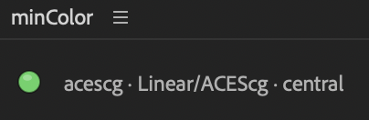
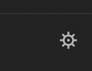
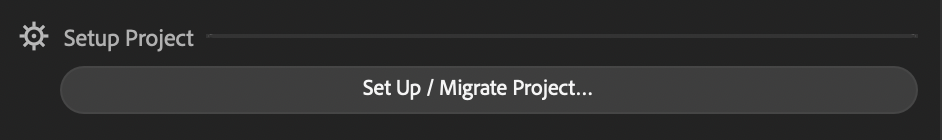
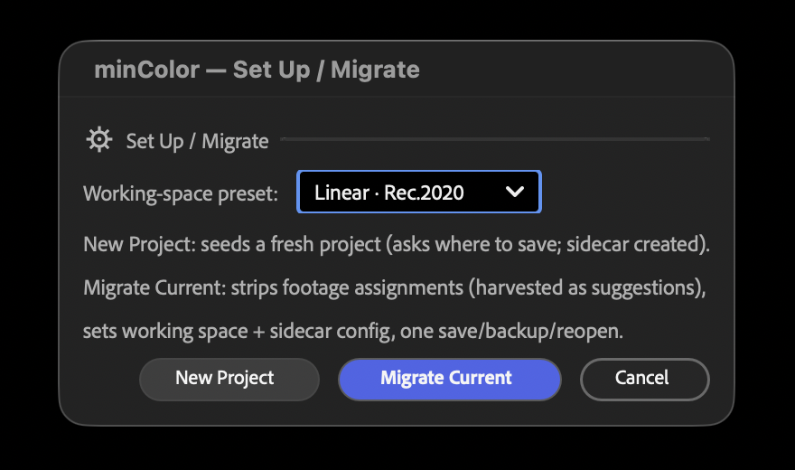
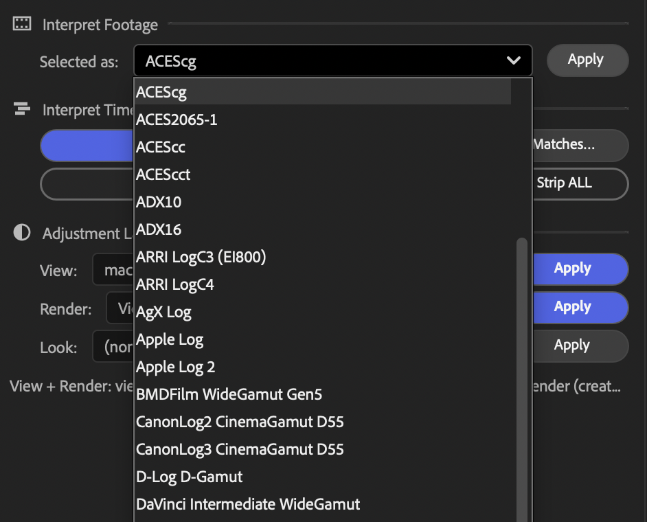
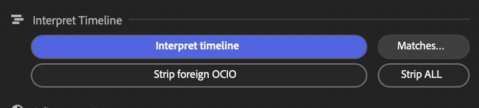
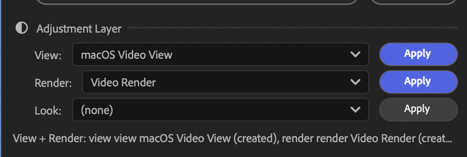

# Using minColor

Open **Window → minColor.jsx** and dock it. The panel has four sections and a status line.

## Status

The status line at the top. Green shows the preset, working space, and where the config is pinned.
Yellow with a **Repair** button means the config path went missing (usually a project that came
from another machine) — click it. Yellow "update available" means the project is pinned to an older
config of its preset; Migrate to the same preset updates it. Red spells out what to fix by hand.

The gear opens **Project…** with provenance, **Archive** (freeze dependencies next to the project)
and **Package for any AE** (translate everything to Adobe-native effects so the project opens
without minColor).

## Setup Project

**Set Up / Migrate Project…** — choose a preset, then **New Project** or **Migrate Current**.

- Linear presets (`ACEScg, ACES2065-1, Linear Rec.709, Linear Rec.2020`) for CG, VFX and HDR work.
- **SDR** (`Rec.709 Gamma 2.2`) for an OCIO workflow similar to Adobe color space.
  

Migrate strips footage-level color assignments (keeping them as suggestions), sets the working
space and config, rebuilds minColor effects for the new preset, and gives the open comp its view
and render layers — one save, backup and reopen.

## Interpret Footage

Select layers, pick a color space under *Selected as*, click **Apply**. Each layer gets a
`minColor: <space> → working` effect.

## Interpret Timeline

**Interpret timeline** walks the active comp and its precomps, interpreting every footage layer.
Suggestions come from your extension table first (**Matches…** edits it), then from what the
project used before, then from file metadata. It finishes by placing the view and render layers
on the comp.

**Strip foreign OCIO** removes OCIO effects that aren't minColor's; **Strip ALL** removes every
OCIO effect. Both are undoable.

## Adjustment Layers

*View* is a guide layer for the viewport only. *Render* is what your output goes through. Pick and
**Apply**; only one of the two is on at a time, and the panel remembers your choices.

- `macOS Desktop View` / `Windows Desktop View` — what the working values look like on that
  platform's screen.
- `macOS Video View` / `Windows Video View` — how a Rec.709 video delivery will look.
- `Desktop Render` (sRGB) / `Video Render` (Rec.1886) — the two deliveries.

*Look* (linear presets) applies an OCIO look, such as ACES gamut compression, on both layers.
